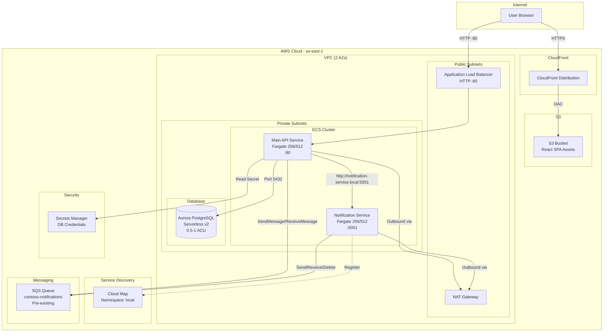

# Design Document

## Overview

This design defines the AWS CDK infrastructure for the Contoso University application, implemented as a single C# stack in the `infra/` folder. The stack provisions a VPC, CloudFront/S3 for the React SPA, two ECS Fargate services (main Web API and notification microservice), an Aurora PostgreSQL Serverless v2 database, and integrates with an existing SQS queue. All resources target `us-east-1`.

The architecture follows a classic three-tier pattern: static frontend via CDN, application tier on Fargate behind a load balancer, and a managed database tier. The notification microservice uses Cloud Map DNS-based service discovery to decouple inter-service communication from IP addresses.

### Design Decisions

| Decision | Choice | Rationale |
|----------|--------|-----------|
| CDK version | v2 (Amazon.CDK.Lib) | Single consolidated package, stable API surface |
| Stack count | 1 | Simpler dependency management; all resources share a VPC |
| NAT Gateway count | 1 | Minimizes cost for non-production workload |
| CloudFront origin access | Origin Access Control (OAC) | AWS-recommended approach over legacy OAI |
| Container image builds | CDK Docker image assets | Builds images at synth/deploy time, pushes to CDK-managed ECR |
| Database credentials | Secrets Manager auto-rotation capable | Secure credential lifecycle |
| SQS integration | Import by URL/ARN | Queue is pre-provisioned; CDK only references it |

## Architecture



## Components and Interfaces

### CDK Project Layout

```
infra/
├── cdk.json                    # CDK app configuration
├── src/
│   └── Infra/
│       ├── Program.cs          # CDK app entry point
│       ├── ContosoStack.cs     # Single stack definition
│       └── Infra.csproj        # C# project file
```

### Component Breakdown

#### 1. Program.cs (Entry Point)

- Instantiates `Amazon.CDK.App`
- Creates `ContosoStack` with explicit `us-east-1` environment
- Calls `app.Synth()`

#### 2. ContosoStack.cs (Stack Definition)

Organizes resources into logical sections:

| Section | Constructs Created |
|---------|-------------------|
| Networking | VPC (2 AZs, 1 NAT GW, public + private subnets) |
| Frontend | S3 bucket, CloudFront distribution with OAC, error responses for SPA routing |
| Compute | ECS Cluster, Task Definitions × 2, Fargate Services × 2, ALB |
| Database | Aurora Serverless v2 cluster, 1 writer instance, Secrets Manager secret |
| Service Discovery | Cloud Map private DNS namespace (`local`), service registration |
| Messaging | Imported SQS queue (from URL/ARN) |
| Security | Task roles with scoped IAM policies, security group rules |

### Interface Contracts

#### Main API Service Environment Variables

| Variable | Source | Example Value |
|----------|--------|---------------|
| `ConnectionStrings__DefaultConnection` | Composed from Secrets Manager fields | `Host=...;Database=...;Username=...;Password=...` |
| `AWS__SQS__QueueUrl` | Imported SQS queue URL | `https://sqs.us-east-1.amazonaws.com/836548370410/contoso-notifications` |
| `NotificationService__BaseUrl` | Static value | `http://notification-service.local:5051` |

#### Notification Service Environment Variables

| Variable | Source | Example Value |
|----------|--------|---------------|
| `AWS__SQS__QueueUrl` | Imported SQS queue URL | `https://sqs.us-east-1.amazonaws.com/836548370410/contoso-notifications` |

#### Security Group Rules

| Source | Destination | Port | Protocol |
|--------|-------------|------|----------|
| ALB SG | Main API SG | 80 | TCP |
| Main API SG | Notification SG | 5051 | TCP |
| Main API SG | Aurora SG | 5432 | TCP |

### Dockerfiles

#### ContosoUniversity-Modernized/Dockerfile

```dockerfile
# Stage 1: Build
FROM mcr.microsoft.com/dotnet/sdk:8.0 AS build
WORKDIR /src
COPY ContosoUniversity-Modernized/ ./ContosoUniversity-Modernized/
WORKDIR /src/ContosoUniversity-Modernized
RUN dotnet publish -c Release -o /app/publish

# Stage 2: Runtime
FROM mcr.microsoft.com/dotnet/aspnet:8.0 AS final
WORKDIR /app
RUN adduser --disabled-password --gecos "" appuser
COPY --from=build /app/publish .
USER appuser
EXPOSE 80
ENV ASPNETCORE_URLS=http://+:80
ENTRYPOINT ["dotnet", "ContosoUniversity.dll"]
```

#### NotificationService.API/Dockerfile

```dockerfile
# Stage 1: Build
FROM mcr.microsoft.com/dotnet/sdk:8.0 AS build
WORKDIR /src
COPY NotificationService.API/ ./NotificationService.API/
WORKDIR /src/NotificationService.API
RUN dotnet publish -c Release -o /app/publish

# Stage 2: Runtime
FROM mcr.microsoft.com/dotnet/aspnet:8.0 AS final
WORKDIR /app
RUN adduser --disabled-password --gecos "" appuser
COPY --from=build /app/publish .
USER appuser
EXPOSE 5051
ENV ASPNETCORE_URLS=http://+:5051
ENTRYPOINT ["dotnet", "NotificationService.API.dll"]
```

## Data Models

### CloudFormation Resources Produced

The CDK stack synthesizes into the following key CloudFormation resource types:

| CDK Construct | CloudFormation Resource | Logical Purpose |
|---------------|------------------------|-----------------|
| `Vpc` | `AWS::EC2::VPC`, subnets, route tables, NAT GW | Network isolation |
| `Bucket` | `AWS::S3::Bucket` | SPA asset storage |
| `Distribution` | `AWS::CloudFront::Distribution` | CDN for frontend |
| `Cluster` | `AWS::ECS::Cluster` | Container orchestration |
| `FargateTaskDefinition` × 2 | `AWS::ECS::TaskDefinition` | Container config |
| `FargateService` × 2 | `AWS::ECS::Service` | Running tasks |
| `ApplicationLoadBalancer` | `AWS::ElasticLoadBalancingV2::LoadBalancer` | HTTP ingress |
| `DatabaseCluster` | `AWS::RDS::DBCluster` | Aurora Serverless v2 |
| `CfnDBInstance` | `AWS::RDS::DBInstance` | Writer instance |
| `PrivateDnsNamespace` | `AWS::ServiceDiscovery::PrivateDnsNamespace` | Cloud Map |

### Database Credentials Schema (Secrets Manager)

The auto-generated secret contains the following JSON structure:

```json
{
  "username": "<auto-generated>",
  "password": "<auto-generated>",
  "engine": "postgres",
  "host": "<cluster-endpoint>",
  "port": 5432,
  "dbClusterIdentifier": "<cluster-id>"
}
```

### CDK Context Values (cdk.json)

```json
{
  "app": "dotnet run --project src/Infra/Infra.csproj",
  "context": {
    "@aws-cdk/aws-ecs:enableExecuteCommand": false
  }
}
```

## Error Handling

### Deployment Failures

| Failure Scenario | CDK Behavior | Mitigation |
|-----------------|--------------|------------|
| Docker build failure | `cdk deploy` fails before stack creation | Ensure Dockerfiles build locally first |
| ECS task fails to start | Service enters DRAINING, CloudFormation rolls back | Check container logs in CloudWatch; verify env vars |
| Aurora creation timeout | CloudFormation rolls back entire stack | Retry; Aurora creation can take 10-15 minutes |
| NAT Gateway limit reached | Stack creation fails | Request quota increase or clean up existing NAT GWs |
| ECR push failure | Deploy fails during asset publishing | Ensure Docker daemon is running; check IAM permissions |

### Runtime Failures

| Failure Scenario | Impact | Detection |
|-----------------|--------|-----------|
| Notification service unreachable | Main API cannot send notifications | Cloud Map DNS resolution fails; application logs error |
| Aurora instance unavailable | Main API returns 500 errors | ALB health check fails; ECS marks task unhealthy |
| SQS queue unreachable | Messages cannot be sent/received | Application-level error handling; CloudWatch alarms |
| Secrets Manager unavailable | Task cannot start (if secret is fetched at boot) | ECS task fails to reach RUNNING state |

### Security Group Defaults

All security groups follow deny-all-inbound by default. Only the explicitly listed ingress rules are opened. Egress is allowed to all destinations (required for NAT Gateway access, ECR pulls, and Secrets Manager API calls).

## Testing Strategy

### Why Property-Based Testing Does Not Apply

This feature is an Infrastructure as Code (IaC) deployment using AWS CDK. CDK code is declarative configuration that synthesizes CloudFormation templates — it does not contain functions with input/output behavior amenable to property-based testing. The "inputs" are fixed configuration values and the "outputs" are deterministic CloudFormation resources. Running 100+ iterations with varying inputs provides no additional value over targeted assertions.

### Recommended Testing Approach

#### 1. CDK Snapshot Tests (Primary)

Use `Amazon.CDK.Assertions` to verify the synthesized CloudFormation template:

- **Template assertions**: Verify specific resources exist with expected properties
- **Snapshot tests**: Detect unintended drift when the stack definition changes

Example assertions to implement:
- VPC has 2 AZs and 1 NAT Gateway
- S3 bucket has BlockPublicAccess enabled
- CloudFront distribution has custom error responses for 403/404 → index.html
- ECS task definitions have correct CPU/memory (256/512)
- Aurora cluster has Serverless v2 scaling configuration (0.5–1 ACU)
- Security groups allow only the specified ingress rules
- IAM policies are scoped to specific resource ARNs
- SQS queue is imported (no `AWS::SQS::Queue` resource in template)
- Environment variables are correctly passed to container definitions

#### 2. Integration Tests (Deployment Validation)

Post-deployment checks against the live environment:

- ALB endpoint returns HTTP 200 on health check path
- CloudFront distribution serves `index.html` for unknown paths
- Notification service is resolvable at `notification-service.local:5051` from within the VPC
- Aurora cluster endpoint accepts connections on port 5432 from the Main API security group

#### 3. Docker Build Tests

- Both Dockerfiles build successfully from the repository root context
- Final images run as non-root user
- Containers respond on their respective ports (80, 5051)

### Test Project Structure

```
infra/
├── test/
│   └── Infra.Tests/
│       ├── Infra.Tests.csproj
│       ├── ContosoStackTests.cs      # CDK assertion tests
│       └── Snapshots/                 # Stored template snapshots
```

### Test Commands

```bash
# Run CDK assertion tests
dotnet test infra/test/Infra.Tests/

# Synthesize template (validates CDK code compiles and produces valid CF)
cd infra && cdk synth

# Deploy to target account
cd infra && cdk deploy
```
