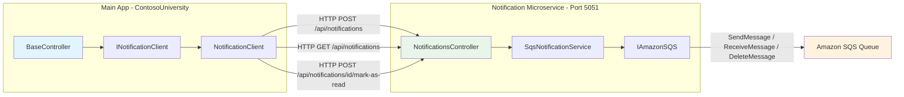

# Design Document: Notification Microservice Extraction

## Overview

This design describes the extraction of notification functionality from the ContosoUniversity monolithic .NET Framework 4.8 application into a standalone .NET 8 ASP.NET Core Web API microservice (NotificationService.API). The microservice exposes three HTTP endpoints — send, retrieve, and mark-as-read — and communicates with Amazon SQS for message queuing. The main application replaces its direct `NotificationService` usage with a typed HttpClient (`INotificationClient` / `NotificationClient`) that calls the microservice over HTTP on localhost:5051.

Key design decisions:
- Controller-based Web API (not minimal APIs) for familiarity with the existing MVC patterns
- Newtonsoft.Json with `StringEnumConverter` for consistent serialization across both projects
- Fire-and-forget semantics: notification failures never block CRUD operations
- No authentication, no Docker, no health checks — optimized for local development and demo scenarios
- 5-second HTTP timeout to prevent notification calls from stalling the main app

## Architecture

### High-Level Architecture Diagram



### Communication Flow

1. **Send Notification**: Controller action completes CRUD → `BaseController.SendEntityNotification()` → `INotificationClient.SendNotificationAsync()` → HTTP POST to microservice → microservice serializes and enqueues to SQS
2. **Retrieve Notifications**: `NotificationsController.GetNotifications()` → `INotificationClient.GetNotificationsAsync()` → HTTP GET to microservice → microservice reads up to 10 messages from SQS, deletes them, returns JSON array
3. **Mark As Read**: `NotificationsController.MarkAsRead(id)` → `INotificationClient.MarkAsReadAsync(id)` → HTTP POST to microservice → microservice returns success (no-op)

### Error Isolation

All HTTP calls from the main app to the microservice are wrapped in try-catch. On any failure (timeout, connection refused, HTTP error), the error is logged to `System.Diagnostics.Debug` and swallowed. CRUD operations always succeed regardless of notification delivery status.

## Components and Interfaces

### Notification Microservice (NotificationService.API)

| Component | Responsibility |
|-----------|---------------|
| `NotificationsController` | ASP.NET Core API controller exposing `/api/notifications` endpoints |
| `SqsNotificationService` | Encapsulates all SQS operations (send, receive, delete) |
| `ISqsNotificationService` | Interface for the SQS service, enabling DI |
| `Notification` (model) | Data model matching the existing schema |
| `SendNotificationRequest` | Request DTO for POST /api/notifications |

### Main App (ContosoUniversity)

| Component | Responsibility |
|-----------|---------------|
| `INotificationClient` | Interface defining async notification operations |
| `NotificationClient` | Typed HttpClient implementation calling the microservice |
| `BaseController` (modified) | Receives `INotificationClient` via constructor DI |
| 6 Entity Controllers (modified) | Pass `INotificationClient` to base via `: base(notificationClient)` |

### Interface Definitions

#### INotificationClient (Main App)

```csharp
public interface INotificationClient
{
    Task SendNotificationAsync(Notification notification);
    Task<List<Notification>> GetNotificationsAsync();
    Task MarkAsReadAsync(int id);
}
```

#### ISqsNotificationService (Microservice)

```csharp
public interface ISqsNotificationService
{
    Task<string> SendNotificationAsync(Notification notification);
    Task<List<Notification>> ReceiveNotificationsAsync();
    Task MarkAsReadAsync(int id);
}
```

## Data Models

### Notification Model (shared schema)

```csharp
public class Notification
{
    public int Id { get; set; }
    public string EntityType { get; set; }
    public string EntityId { get; set; }
    public string Operation { get; set; }  // "CREATE", "UPDATE", "DELETE"
    public string Message { get; set; }
    public DateTime CreatedAt { get; set; }
    public string CreatedBy { get; set; }
    public bool IsRead { get; set; }
}
```

### SendNotificationRequest DTO (Microservice)

```csharp
public class SendNotificationRequest
{
    [Required]
    public string EntityType { get; set; }

    [Required]
    public string EntityId { get; set; }

    [Required]
    public string Operation { get; set; }  // Must be "CREATE", "UPDATE", or "DELETE"

    [Required]
    public string Message { get; set; }

    [Required]
    public DateTime CreatedAt { get; set; }

    public string CreatedBy { get; set; }
}
```

### API Contracts

#### POST /api/notifications

**Request:**
```json
{
    "entityType": "Student",
    "entityId": "42",
    "operation": "CREATE",
    "message": "New Student 'John Smith' has been created",
    "createdAt": "2024-01-15T10:30:00Z",
    "createdBy": "System"
}
```

**Success Response (200):**
```json
{
    "success": true,
    "messageId": "a1b2c3d4-e5f6-7890-abcd-ef1234567890"
}
```

**Validation Error Response (400):**
```json
{
    "success": false,
    "message": "Operation must be one of: CREATE, UPDATE, DELETE"
}
```

**Server Error Response (500):**
```json
{
    "success": false,
    "message": "Failed to send message to SQS: Access Denied"
}
```

#### GET /api/notifications

**Success Response (200):**
```json
[
    {
        "id": 0,
        "entityType": "Student",
        "entityId": "42",
        "operation": "CREATE",
        "message": "New Student 'John Smith' has been created",
        "createdAt": "2024-01-15T10:30:00Z",
        "createdBy": "System",
        "isRead": false
    }
]
```

**Empty Queue Response (200):**
```json
[]
```

**Server Error Response (500):**
```json
{
    "success": false,
    "message": "Failed to receive messages from SQS"
}
```

#### POST /api/notifications/{id}/mark-as-read

**Success Response (200):**
```json
{
    "success": true
}
```

**Invalid ID Response (400):**
ASP.NET Core default model binding error for invalid integer.

### Configuration (appsettings.json - Microservice)

```json
{
    "AWS": {
        "Region": "us-east-1",
        "SQS": {
            "QueueUrl": "https://sqs.us-east-1.amazonaws.com/836548370410/contoso-notifications"
        }
    }
}
```

### DI Registration (Main App - Program.cs)

```csharp
builder.Services.AddHttpClient<INotificationClient, NotificationClient>(client =>
{
    client.BaseAddress = new Uri("http://localhost:5051");
    client.Timeout = TimeSpan.FromSeconds(5);
});
```

### DI Registration (Microservice - Program.cs)

```csharp
// SQS client as singleton
var region = builder.Configuration["AWS:Region"];
builder.Services.AddSingleton<IAmazonSQS>(sp =>
    new AmazonSQSClient(RegionEndpoint.GetBySystemName(region)));

// Notification service
builder.Services.AddScoped<ISqsNotificationService, SqsNotificationService>();

// Newtonsoft.Json with StringEnumConverter
builder.Services.AddControllers()
    .AddNewtonsoftJson(options =>
    {
        options.SerializerSettings.Converters.Add(new StringEnumConverter());
    });
```


## Correctness Properties

*A property is a characteristic or behavior that should hold true across all valid executions of a system — essentially, a formal statement about what the system should do. Properties serve as the bridge between human-readable specifications and machine-verifiable correctness guarantees.*

### Property 1: Notification Serialization Round-Trip

*For any* valid Notification object (with non-empty EntityType, EntityId, Operation in {"CREATE","UPDATE","DELETE"}, non-empty Message, valid CreatedAt, and any CreatedBy string), serializing it with Newtonsoft.Json + StringEnumConverter and then deserializing the resulting JSON string should produce a Notification object with all fields equal to the original.

**Validates: Requirements 2.1, 3.2, 5.5**

### Property 2: Invalid Input Rejection

*For any* request body that is either missing a required field (EntityType, EntityId, Operation, Message, or CreatedAt is null/empty) OR has an Operation value that is not exactly "CREATE", "UPDATE", or "DELETE", the POST /api/notifications endpoint should return HTTP 400 with `success: false`.

**Validates: Requirements 2.4, 2.5**

### Property 3: Fire-and-Forget Resilience

*For any* notification payload and any exception type thrown by INotificationClient.SendNotificationAsync (including HttpRequestException, TaskCanceledException, and any other Exception), the BaseController.SendEntityNotification method should complete without throwing, allowing the calling CRUD operation to proceed to its normal return path.

**Validates: Requirements 7.1, 7.2**

## Error Handling

### Microservice Error Handling

| Scenario | Behavior |
|----------|----------|
| Valid request, SQS succeeds | Return 200 with `{ success: true, messageId: "..." }` |
| Valid request, SQS fails | Return 500 with `{ success: false, message: "..." }` |
| Invalid/missing request body | Return 400 with `{ success: false, message: "..." }` |
| Invalid Operation value | Return 400 with `{ success: false, message: "..." }` |
| Malformed message in SQS (can't deserialize) | Skip message, delete from queue, exclude from response |
| Invalid id parameter on mark-as-read | Return 400 (ASP.NET model binding) |

### Main App Error Handling

| Scenario | Behavior |
|----------|----------|
| Microservice unreachable (SendNotification) | Log to Debug, swallow exception, CRUD completes |
| Microservice returns HTTP error (SendNotification) | Log to Debug, swallow exception, CRUD completes |
| Microservice unreachable (GetNotifications) | Return empty list to UI |
| Microservice unreachable (MarkAsRead) | Swallow exception silently |
| HTTP timeout (> 5 seconds) | TaskCanceledException caught and swallowed |

### Error Handling Implementation Pattern

```csharp
// In BaseController.SendEntityNotification
protected async void SendEntityNotification(string entityType, string entityId, 
    string entityDisplayName, EntityOperation operation)
{
    try
    {
        var notification = new Notification
        {
            EntityType = entityType,
            EntityId = entityId,
            Operation = operation.ToString(),
            Message = GenerateMessage(entityType, entityId, entityDisplayName, operation),
            CreatedAt = DateTime.UtcNow,
            CreatedBy = "System",
            IsRead = false
        };
        await _notificationClient.SendNotificationAsync(notification);
    }
    catch (Exception ex)
    {
        System.Diagnostics.Debug.WriteLine($"Failed to send notification: {ex.Message}");
    }
}
```

## Testing Strategy

### Approach

Since the user has explicitly requested no unit tests, the testing strategy focuses on manual verification and build-time checks:

1. **Build Verification**: `dotnet build` on the solution compiles both projects without errors
2. **Manual Integration Testing**: Run both apps and verify end-to-end notification flow using the notification dashboard UI
3. **Error Isolation Testing**: Stop the microservice and verify CRUD operations still work in the main app

### Property-Based Testing Applicability

While three correctness properties have been identified, the user has explicitly stated "no unit tests." If tests are added in the future, the recommended PBT library for .NET 8 is **FsCheck** (with the FsCheck.Xunit runner) or **Hedgehog** for C#. Each property should be configured with a minimum of 100 iterations.

### Future Test Tag Format

If property-based tests are implemented later:
- **Feature: notification-microservice-extraction, Property 1: Notification serialization round-trip preserves all fields**
- **Feature: notification-microservice-extraction, Property 2: Invalid input always rejected with 400**
- **Feature: notification-microservice-extraction, Property 3: Fire-and-forget never throws regardless of exception type**

### Manual Verification Checklist

1. Start NotificationService.API on port 5051
2. Start ContosoUniversity main app
3. Create/Edit/Delete a Student → verify notification appears in SQS (via AWS Console or GET endpoint)
4. Visit notification dashboard → verify notifications are displayed
5. Stop NotificationService.API → Create a Student → verify no error shown to user
6. Verify `dotnet build` succeeds for the full solution
