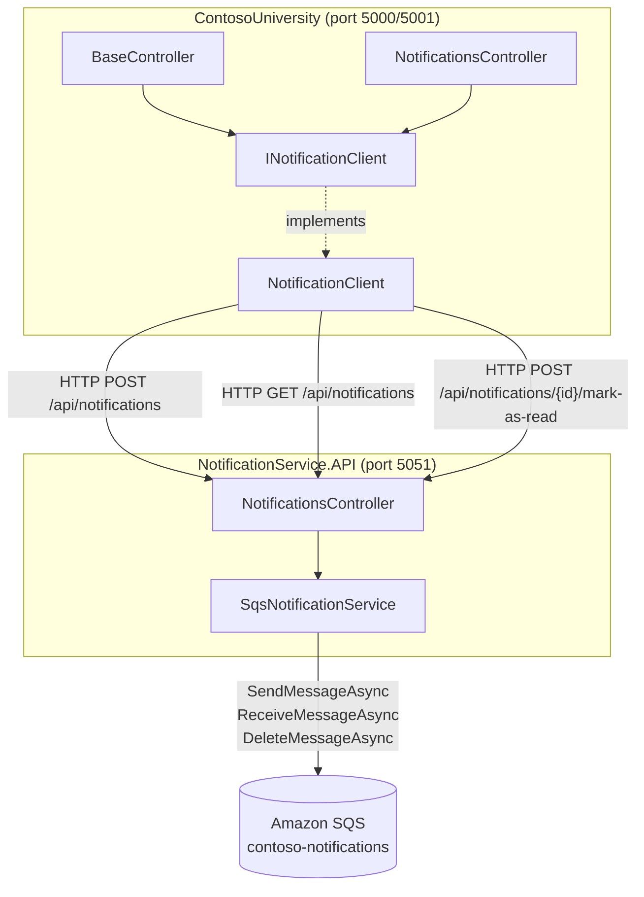
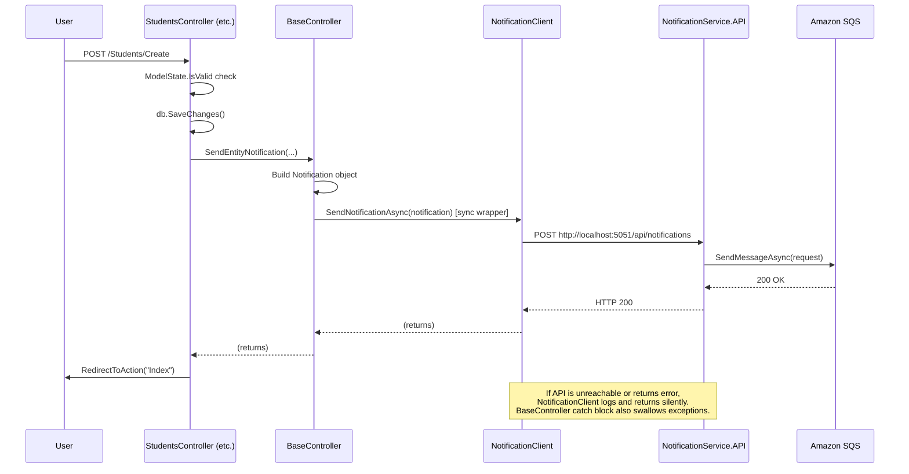
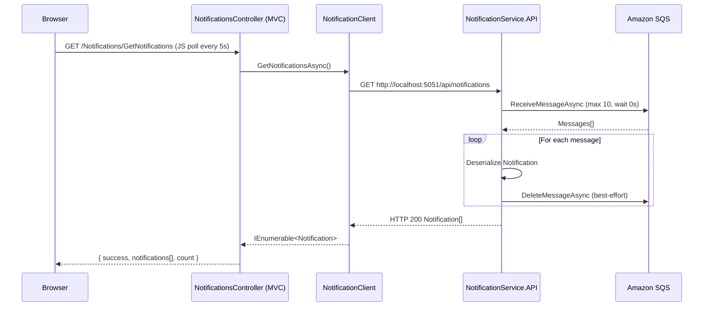

# Design Document: Notification Service API

## Overview

This design covers the extraction of `NotificationService` from the ContosoUniversity ASP.NET Core MVC monolith into a standalone `NotificationService.API` microservice, and the corresponding refactor of the main application to consume it over HTTP.

The change replaces a process-local object that writes directly to Amazon SQS with a two-process model: the new microservice owns the SQS connection, and the main application talks to it through a typed `HttpClient` abstraction. The public behavior of every CRUD controller is unchanged — notifications remain fire-and-forget and any failure is silently swallowed.

### Goals

- Create `NotificationService.API`: a controller-based ASP.NET Core Web API (.NET 8) that wraps the three SQS operations (send, receive, mark-as-read).
- Refactor `ContosoUniversity` to call the API through `INotificationClient` / `NotificationClient` instead of directly instantiating `NotificationService`.
- Preserve fire-and-forget error isolation so no CRUD operation can fail due to a notification problem.
- Keep the Notifications view and its JavaScript polling intact without modification.

### Non-Goals

- No authentication or authorization is added to either project.
- No HTTPS configuration.
- No persistent read-state store (mark-as-read remains a no-op, matching the existing behavior).
- No shared class library for the `Notification` model — it is copied into the new project.
- No Docker configuration.

---

## Architecture

The system after the refactor consists of two ASP.NET Core processes within the same solution.



### Key Design Decisions

**Controller-based routing over Minimal APIs.** The user explicitly chose the controller-based template to match the existing codebase conventions and to make the new project structurally familiar.

**Typed HttpClient pattern.** `AddHttpClient<INotificationClient, NotificationClient>()` integrates with the ASP.NET Core DI container and lifecycle management, and keeps `HttpClient` socket reuse correct.

**Copy model, no shared library.** A shared class library adds a project dependency and an additional maintenance surface. Because the model is small and frozen, copying it is the lower-risk choice for this extraction scope.

**Singleton SQS service.** `AmazonSQSClient` is thread-safe and designed to be long-lived. A singleton avoids per-request connection overhead and matches the original `NotificationService` which held a single client for the lifetime of the controller instance.

**Hardcoded queue URL constant.** The existing `NotificationService` already uses a hardcoded constant. Extracting the constant to `appsettings.json` is out of scope; it can be done in a follow-on step.

**Synchronous wrapper on BaseController.** `SendEntityNotification` is a `void` synchronous method called by all CRUD action methods. Rather than making the six action methods `async` (a large change surface), the design keeps `SendEntityNotification` synchronous and calls `SendNotificationAsync(...).GetAwaiter().GetResult()` inside the existing try/catch. This exactly preserves the call-site pattern.

---

## Components and Interfaces

### NotificationService.API

#### Project layout

```
NotificationService.API/
├── Controllers/
│   └── NotificationsController.cs
├── Models/
│   ├── Notification.cs          # copied from ContosoUniversity.Models
│   └── EntityOperation.cs       # enum, same namespace as Notification
├── Services/
│   ├── ISqsNotificationService.cs
│   └── SqsNotificationService.cs
├── Properties/
│   └── launchSettings.json      # HTTP only, port 5051
├── NotificationService.API.csproj
└── Program.cs
```

#### `ISqsNotificationService`

```csharp
namespace NotificationService.API.Services
{
    public interface ISqsNotificationService
    {
        Task SendNotificationAsync(Notification notification);
        Task<List<Notification>> GetNotificationsAsync();
        Task MarkAsReadAsync(int id);
    }
}
```

#### `SqsNotificationService`

Encapsulates all SQS interaction. Registered as a singleton.

Responsibilities:
- Holds `private readonly AmazonSQSClient _sqsClient` created with `RegionEndpoint.USEast1`.
- Holds `private const string QueueUrl = "https://sqs.us-east-1.amazonaws.com/836548370410/contoso-notifications"`.
- `SendNotificationAsync`: serializes using `JsonConvert.SerializeObject` with `StringEnumConverter`, calls `SendMessageAsync`.
- `GetNotificationsAsync`: calls `ReceiveMessageAsync` with `MaxNumberOfMessages = 10`, `WaitTimeSeconds = 0`; deserializes each message body; issues best-effort `DeleteMessageAsync` for every message (valid or malformed); returns the successfully deserialized list.
- `MarkAsReadAsync`: no-op (matching existing behavior); returns immediately.

#### `NotificationsController` (API project)

Thin controller that delegates to `ISqsNotificationService`. Does not contain SQS logic directly.

| Route | Method | Action |
|---|---|---|
| `/api/notifications` | POST | `SendNotification([FromBody] Notification n)` |
| `/api/notifications` | GET | `GetNotifications()` |
| `/api/notifications/{id}/mark-as-read` | POST | `MarkAsRead(int id)` |

Validation rules enforced at the controller level:
- `SendNotification`: returns 400 if `notification` is null or any of `EntityType`, `EntityId`, `Operation`, `Message`, `CreatedAt` is null or empty.
- `MarkAsRead`: returns 400 if `id < 1`.

#### `Program.cs` (API project)

```csharp
var builder = WebApplication.CreateBuilder(args);
builder.Services.AddControllers()
    .AddNewtonsoftJson(options =>
        options.SerializerSettings.Converters.Add(new StringEnumConverter()));
builder.Services.AddSingleton<ISqsNotificationService, SqsNotificationService>();
var app = builder.Build();
app.MapControllers();
app.Run();
```

---

### ContosoUniversity (refactored)

#### `INotificationClient`

```csharp
namespace ContosoUniversity.Services
{
    public interface INotificationClient
    {
        Task SendNotificationAsync(Notification notification);
        Task<IEnumerable<Notification>> GetNotificationsAsync();
        Task MarkAsReadAsync(int id);
    }
}
```

Placed in `Services/` to match where `NotificationService.cs` currently lives.

#### `NotificationClient`

```csharp
namespace ContosoUniversity.Services
{
    public class NotificationClient : INotificationClient
    {
        private const string BaseAddress = "http://localhost:5051";
        private readonly HttpClient _http;
        private readonly ILogger<NotificationClient> _logger;

        public NotificationClient(HttpClient http, ILogger<NotificationClient> logger)
        {
            _http = http;
            _logger = logger;
        }

        // SendNotificationAsync, GetNotificationsAsync, MarkAsReadAsync
        // All wrapped in try/catch — exceptions are logged, never rethrown.
        // GetNotificationsAsync returns empty IEnumerable<Notification> on any error.
    }
}
```

Key behaviors:
- Serialization: `JsonConvert.SerializeObject` / `JsonConvert.DeserializeObject<List<Notification>>` with `StringEnumConverter`, wrapped in `StringContent(..., "application/json")`.
- Non-success HTTP response codes are treated as errors (logged, not thrown).
- `GetNotificationsAsync` returns `Enumerable.Empty<Notification>()` on any failure.

#### `BaseController` (refactored)

Changes:
1. Remove `protected NotificationService notificationService = new NotificationService()`.
2. Add `protected readonly INotificationClient _notificationClient` field.
3. Constructor becomes `BaseController(SchoolContext context, INotificationClient notificationClient)`.
4. `SendEntityNotification` calls `_notificationClient.SendNotificationAsync(notification).GetAwaiter().GetResult()` inside the existing try/catch.
5. Remove the `Dispose` override.

Both overloads of `SendEntityNotification` are preserved:
- `SendEntityNotification(string entityType, string entityId, EntityOperation operation)`
- `SendEntityNotification(string entityType, string entityId, string entityDisplayName, EntityOperation operation)`

The `Notification` object is constructed inside `SendEntityNotification` with:
- `EntityType`, `EntityId`, `Operation` (`.ToString()`), `Message` (generated by the existing message-generation logic), `CreatedAt = DateTime.UtcNow`, `CreatedBy = "System"`, `IsRead = false`.

#### `NotificationsController` (MVC project, refactored)

Constructor changes to `NotificationsController(SchoolContext context, INotificationClient notificationClient) : base(context, notificationClient)`.

`GetNotifications` calls `_notificationClient.GetNotificationsAsync()` and returns:
```json
{ "success": true, "notifications": [...], "count": N }
```

`MarkAsRead(int id)` calls `_notificationClient.MarkAsReadAsync(id)` and returns:
```json
{ "success": true }
```

#### DI registration in `Program.cs` (ContosoUniversity)

```csharp
builder.Services.AddHttpClient<INotificationClient, NotificationClient>(client =>
{
    client.BaseAddress = new Uri("http://localhost:5051");
});
```

The `AWSSDK.SQS` package reference is removed from `ContosoUniversity.csproj` after all `Amazon.SQS` usages are gone.

---

## Data Models

### `Notification` (shared shape, two namespaces)

| Property | Type | Attributes |
|---|---|---|
| `Id` | `int` | `[Key]` |
| `EntityType` | `string` | `[Required]`, `[StringLength(100)]` |
| `EntityId` | `string` | `[Required]`, `[StringLength(50)]` |
| `Operation` | `string` | `[Required]`, `[StringLength(20)]` |
| `Message` | `string` | `[Required]`, `[StringLength(256)]` |
| `CreatedAt` | `DateTime` | `[Required]` |
| `CreatedBy` | `string` | `[StringLength(100)]` |
| `IsRead` | `bool` | — |
| `ReadAt` | `DateTime?` | — |

Namespace in ContosoUniversity: `ContosoUniversity.Models`
Namespace in API: `NotificationService.API.Models`

### `EntityOperation` enum

```csharp
public enum EntityOperation { CREATE, UPDATE, DELETE }
```

Serialized as strings via `StringEnumConverter` in both projects. The `Operation` property on `Notification` is `string` (not the enum) so the wire format is always a plain string (`"CREATE"`, `"UPDATE"`, `"DELETE"`), consistent with the existing SQS message format.

### SQS Message Wire Format (example)

```json
{
  "Id": 0,
  "EntityType": "Student",
  "EntityId": "42",
  "Operation": "CREATE",
  "Message": "New Student 'Jane Doe' has been created",
  "CreatedAt": "2024-01-15T10:30:00",
  "CreatedBy": "System",
  "IsRead": false,
  "ReadAt": null
}
```

`Id` is 0 for outbound messages because the SQS queue is not a persistent store; the field exists only because the model is shared with the EF Core `Notification` table.

### HTTP Request / Response Shapes

**POST /api/notifications**
- Request: `Notification` JSON object (Content-Type: application/json)
- Response 200: empty body
- Response 400: `{ "error": "..." }` (bad request details)
- Response 500: empty body

**GET /api/notifications**
- Response 200: `Notification[]` JSON array
- Response 500: empty body

**POST /api/notifications/{id}/mark-as-read**
- Response 200: `{ "success": true }`
- Response 400: model binding error (id not a valid positive integer)

---

## Data Flow

### CRUD Operation → Notification (fire-and-forget)



### Notification Dashboard → Retrieve Notifications



---

## Correctness Properties

*A property is a characteristic or behavior that should hold true across all valid executions of a system — essentially, a formal statement about what the system should do. Properties serve as the bridge between human-readable specifications and machine-verifiable correctness guarantees.*

Property-based testing applies here because the core logic (serialization, HTTP routing, input validation, error isolation) involves pure or near-pure functions where input variation meaningfully exercises edge cases. All properties below use a mocked `AmazonSQSClient` / `HttpMessageHandler` to avoid live AWS calls.

---

### Property 1: Notification Serialization Round-Trip

*For any* valid `Notification` object (with any combination of `EntityType`, `EntityId`, `Operation`, `Message`, `CreatedAt`, `CreatedBy`, `IsRead`, `ReadAt` values), serializing it with `JsonConvert.SerializeObject` using `StringEnumConverter` and then deserializing the result with `JsonConvert.DeserializeObject<Notification>` using the same settings SHALL produce an object with equivalent field values.

**Validates: Requirements 2.1, 2.5, 3.3, 5.3**

---

### Property 2: Invalid Notification Body Returns 400

*For any* POST request to `/api/notifications` where the body is null, fails to deserialize, or any required field (`EntityType`, `EntityId`, `Operation`, `Message`, `CreatedAt`) is null, empty, or whitespace-only, the controller SHALL return HTTP 400 Bad Request and SHALL NOT call `SendMessageAsync` on the SQS client.

**Validates: Requirements 2.3**

---

### Property 3: All Retrieved SQS Messages Are Deleted

*For any* batch of N messages returned by `ReceiveMessageAsync` (where 1 ≤ N ≤ 10), including messages with malformed bodies that cannot be deserialized, the `SqsNotificationService` SHALL call `DeleteMessageAsync` exactly N times — once per message — and SHALL return only the successfully deserialized notifications in the result list.

**Validates: Requirements 3.2, 3.6**

---

### Property 4: Invalid Mark-As-Read ID Returns 400

*For any* POST to `/api/notifications/{id}/mark-as-read` where `id` is a non-numeric string, zero, a negative integer, or a value exceeding `int.MaxValue`, the controller SHALL return HTTP 400 Bad Request.

**Validates: Requirements 4.2, 4.3**

---

### Property 5: Mark-As-Read Is Idempotent and Always Succeeds for Valid IDs

*For any* valid positive integer `id` (in the range 1 to 2,147,483,647), calling POST `/api/notifications/{id}/mark-as-read` any number of times SHALL always return HTTP 200 OK with `{ "success": true }`. The result SHALL be independent of the `id` value and the call count.

**Validates: Requirements 4.1, 4.4**

---

### Property 6: NotificationClient Swallows All Errors

*For any* combination of failure mode in `NotificationClient` (network exception, `HttpRequestException`, `TaskCanceledException`, HTTP 4xx response, HTTP 5xx response), no exception SHALL propagate out of `SendNotificationAsync`, `GetNotificationsAsync`, or `MarkAsReadAsync`. Additionally, `GetNotificationsAsync` SHALL return an empty (non-null) `IEnumerable<Notification>` rather than null when an error occurs.

**Validates: Requirements 6.7, 6.8**

---

### Property 7: Notification Failures Do Not Interrupt CRUD Operations

*For any* CRUD controller action (Create, Edit, Delete) in `StudentsController`, `CoursesController`, `DepartmentsController`, or `InstructorsController`, when the injected `INotificationClient` throws any exception or returns a failed result for `SendNotificationAsync`, the action SHALL still commit the entity change to the database and return the expected redirect result, with no exception propagating to the caller.

**Validates: Requirements 10.1, 10.2, 10.3, 10.4**

---

## Error Handling

### NotificationService.API

| Scenario | Handling |
|---|---|
| Null or invalid request body (POST /api/notifications) | Return 400 before calling SQS |
| Required field null or empty | Return 400 |
| `SendMessageAsync` throws | Log to `Debug.WriteLine`, return 500 |
| `ReceiveMessageAsync` throws | Log to `Debug.WriteLine`, return 500 |
| `DeleteMessageAsync` throws (per-message) | Log to `Debug.WriteLine`, continue; do not propagate |
| Message deserialization failure | Log to `Debug.WriteLine`, delete the malformed message (best-effort), skip |
| `id` ≤ 0 on mark-as-read | Return 400 |

AWS credential errors at startup are not caught — the application fails fast, which surfaces the misconfiguration immediately.

### ContosoUniversity (`NotificationClient`)

| Scenario | Handling |
|---|---|
| `HttpClient` throws `HttpRequestException` | Log via `ILogger<NotificationClient>`, return/swallow |
| `HttpClient` throws `TaskCanceledException` (timeout) | Log via `ILogger<NotificationClient>`, return/swallow |
| Response status code outside 200–299 | Log via `ILogger<NotificationClient>`, return/swallow |
| `GetNotificationsAsync` error | Return `Enumerable.Empty<Notification>()` |
| `SendNotificationAsync` error | Return (void method, no rethrow) |
| `MarkAsReadAsync` error | Return (void method, no rethrow) |

### ContosoUniversity (`BaseController`)

`SendEntityNotification` wraps the `_notificationClient.SendNotificationAsync(...).GetAwaiter().GetResult()` call in a try/catch block that logs to `System.Diagnostics.Debug.WriteLine` and does not rethrow. This is the outer safety net in the call chain. The DB `SaveChanges()` call is always made before `SendEntityNotification` is called, so a notification failure cannot roll back the persisted entity change.

---

## Testing Strategy

### Dual Testing Approach

Unit tests cover specific examples and error conditions. Property-based tests cover universal properties across many generated inputs. Both are necessary.

### Test Projects

Two test projects are added to the solution:

- `NotificationService.API.Tests` — xUnit, tests the API controller and SQS service layer.
- `ContosoUniversity.Tests` — xUnit, tests `NotificationClient`, `BaseController`, and the refactored MVC controllers.

### Property-Based Testing Library

**FsCheck** (via `FsCheck.Xunit`) is used for property-based testing in both projects. It integrates cleanly with xUnit and generates `Arbitrary<T>` instances for custom types. Each property test is configured to run a minimum of 100 iterations (`MaxTest = 100`).

Tag format for property tests:
```
// Feature: notification-service-api, Property N: <property_text>
```

### Unit Tests (example-based)

| Area | Tests |
|---|---|
| `SqsNotificationService.SendNotificationAsync` | Verifies `SendMessageAsync` is called; verifies serialized body round-trips |
| `SqsNotificationService.GetNotificationsAsync` | Empty queue returns empty list; SQS exception returns exception; delete is called per message |
| `NotificationsController (API)` | Valid POST → 200; null body → 400; SQS error → 500; GET empty → `[]`; mark-as-read id=0 → 400 |
| `NotificationClient.SendNotificationAsync` | Correct POST URL, Content-Type header, serialized body |
| `NotificationClient.GetNotificationsAsync` | Correct GET URL; deserialized list returned; error returns empty collection |
| `NotificationClient.MarkAsReadAsync` | Correct POST URL pattern `/api/notifications/{id}/mark-as-read` |
| `BaseController.SendEntityNotification` | Notification object fields populated correctly; exception from client is swallowed |
| `NotificationsController (MVC)` | `GetNotifications` returns `success/notifications/count` shape; `MarkAsRead` returns `success` |

### Property-Based Tests

Each property listed in the Correctness Properties section above maps to one property-based test:

| Property | Test name | Generator |
|---|---|---|
| P1: Serialization round-trip | `NotificationSerializationRoundTrip` | `Arbitrary<Notification>` with valid field values |
| P2: Invalid body → 400 | `InvalidNotificationBodyReturns400` | `Arbitrary<Notification?>` with null/empty required fields |
| P3: All messages deleted | `AllSqsMessagesAreDeleted` | `Gen.ListOf(1, 10, Arbitrary<string>)` including malformed JSON strings |
| P4: Invalid id → 400 | `InvalidMarkAsReadIdReturns400` | `Arbitrary<int>` filtered to ≤ 0 plus random non-numeric strings |
| P5: Mark-as-read idempotent | `MarkAsReadIdempotent` | `Arbitrary<int>` filtered to positive range; repeated calls |
| P6: Client swallows errors | `NotificationClientSwallowsErrors` | `Arbitrary<Exception>` subclasses plus `Arbitrary<HttpStatusCode>` for 4xx/5xx |
| P7: CRUD succeeds despite notification failure | `CrudSucceedsDespiteNotificationFailure` | Mocked `INotificationClient` throwing; `Arbitrary` entity models |

### Integration Tests (manual / out-of-scope for automated CI)

End-to-end integration tests that exercise the real SQS queue are outside the automated test scope for this extraction. The existing manual smoke test procedure in `SETUP_TESTING_GUIDE.md` covers this.
