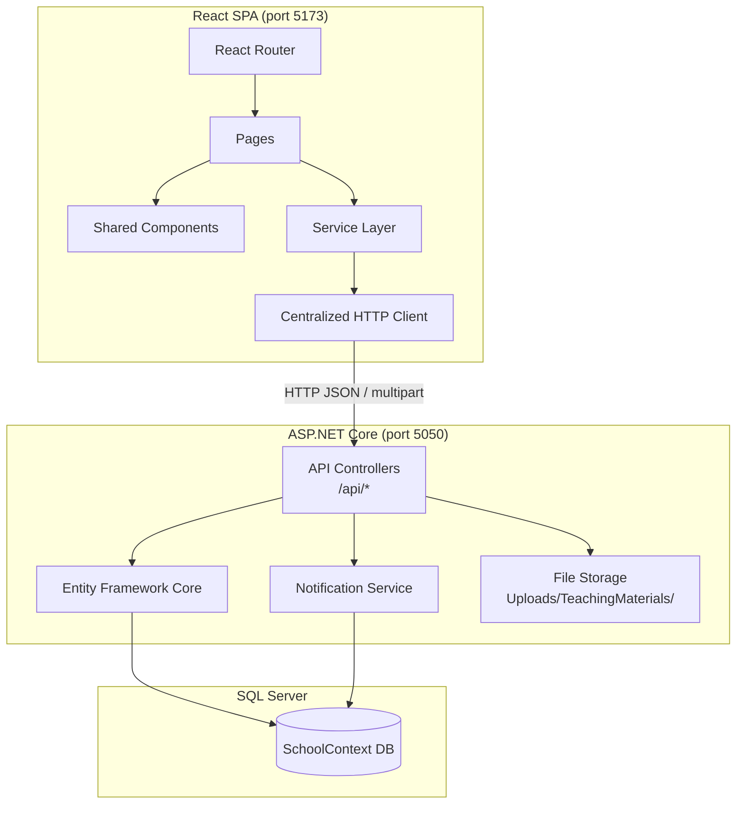
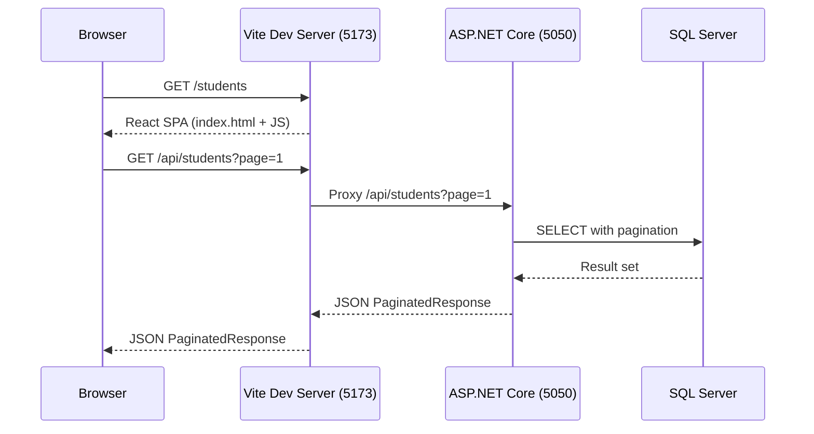

# Design Document: React Frontend Refactor

## Overview

This design describes the refactoring of the Contoso University Modernized application from server-rendered MVC Razor Views to a decoupled architecture with REST API controllers (ASP.NET Core) and a React single-page application (Vite + TypeScript + Material UI).

The architecture separates concerns into two layers:
1. **API Layer** — ASP.NET Core `[ApiController]` endpoints under `Controllers/Api/` returning JSON, reusing the existing Entity Framework Core data layer and models unchanged.
2. **SPA Layer** — A Vite-powered React TypeScript app at `ContosoUniversity-Modernized/client-app/` consuming the API via a centralized HTTP client.

### Design Decisions and Rationale

| Decision | Rationale |
|----------|-----------|
| REST API controllers in a separate `Controllers/Api/` namespace | Avoids collision with existing MVC controllers during migration; allows parallel development and eventual cleanup |
| Vite + TypeScript | Fast HMR dev loop, strong typing reduces runtime errors, modern tooling |
| Material UI (MUI) | Production-ready component library with built-in accessibility, reduces custom CSS effort |
| Dev proxy (port 5173 → 5050) | Standard Vite proxy avoids CORS config; mirrors production path layout |
| Server-side pagination for Students | Dataset can grow unbounded; client doesn't need all records in memory |
| Multipart/form-data for uploads | Standard browser-native file upload mechanism; no base64 bloat |
| RowVersion for Department concurrency | Leverages existing EF Core optimistic concurrency infrastructure |
| Notification polling (5s interval) | Simple implementation with no WebSocket infrastructure needed; acceptable latency for admin notifications |
| No authentication | Simplifies initial refactor; can be layered on later without architectural changes |
| No SSR | SPA is sufficient for internal admin tooling; eliminates Node.js server dependency |

## Architecture



### Request Flow



## Components and Interfaces

### API Layer (ASP.NET Core)

All API controllers inherit from `ControllerBase`, use `[ApiController]` attribute, and route under `api/[controller]`.

#### StudentsApiController

| Endpoint | Method | Request | Response |
|----------|--------|---------|----------|
| `/api/students` | GET | `?page=1&pageSize=10&sortOrder=name_asc&searchString=` | `PaginatedResponse<StudentDto>` |
| `/api/students/{id}` | GET | — | `StudentDetailDto` |
| `/api/students` | POST | `CreateStudentRequest` JSON | 201 + `StudentDto` |
| `/api/students/{id}` | PUT | `UpdateStudentRequest` JSON | 200 + `StudentDto` |
| `/api/students/{id}` | DELETE | — | 204 |

#### CoursesApiController

| Endpoint | Method | Request | Response |
|----------|--------|---------|----------|
| `/api/courses` | GET | — | `CourseDto[]` |
| `/api/courses/{id}` | GET | — | `CourseDetailDto` |
| `/api/courses` | POST | `multipart/form-data` (fields + file) | 201 + `CourseDto` |
| `/api/courses/{id}` | PUT | `multipart/form-data` (fields + file) | 200 + `CourseDto` |
| `/api/courses/{id}` | DELETE | — | 204 |

#### DepartmentsApiController

| Endpoint | Method | Request | Response |
|----------|--------|---------|----------|
| `/api/departments` | GET | — | `DepartmentDto[]` |
| `/api/departments/{id}` | GET | — | `DepartmentDetailDto` (includes RowVersion) |
| `/api/departments` | POST | `CreateDepartmentRequest` JSON | 201 + `DepartmentDto` |
| `/api/departments/{id}` | PUT | `UpdateDepartmentRequest` JSON (includes RowVersion) | 200 + `DepartmentDto` |
| `/api/departments/{id}` | DELETE | — | 204 |

#### InstructorsApiController

| Endpoint | Method | Request | Response |
|----------|--------|---------|----------|
| `/api/instructors` | GET | — | `InstructorDto[]` |
| `/api/instructors/{id}` | GET | — | `InstructorDetailDto` |
| `/api/instructors` | POST | `CreateInstructorRequest` JSON | 201 + `InstructorDto` |
| `/api/instructors/{id}` | PUT | `UpdateInstructorRequest` JSON | 200 + `InstructorDto` |
| `/api/instructors/{id}` | DELETE | — | 204 |

#### NotificationsApiController

| Endpoint | Method | Request | Response |
|----------|--------|---------|----------|
| `/api/notifications` | GET | — | `NotificationDto[]` (max 10, unread, desc) |
| `/api/notifications/{id}/mark-read` | POST | — | 200 |

### React SPA Layer

#### Directory Structure

```
client-app/
├── index.html
├── package.json
├── tsconfig.json
├── vite.config.ts
└── src/
    ├── main.tsx
    ├── App.tsx
    ├── components/
    │   ├── Layout.tsx
    │   ├── NavBar.tsx
    │   ├── ConfirmDialog.tsx
    │   ├── LoadingIndicator.tsx
    │   ├── ErrorNotification.tsx
    │   └── NotFoundPage.tsx
    ├── pages/
    │   ├── students/
    │   │   ├── StudentList.tsx
    │   │   ├── StudentCreate.tsx
    │   │   ├── StudentEdit.tsx
    │   │   └── StudentDetails.tsx
    │   ├── courses/
    │   │   ├── CourseList.tsx
    │   │   ├── CourseCreate.tsx
    │   │   ├── CourseEdit.tsx
    │   │   └── CourseDetails.tsx
    │   ├── departments/
    │   │   ├── DepartmentList.tsx
    │   │   ├── DepartmentCreate.tsx
    │   │   ├── DepartmentEdit.tsx
    │   │   └── DepartmentDetails.tsx
    │   ├── instructors/
    │   │   ├── InstructorList.tsx
    │   │   ├── InstructorCreate.tsx
    │   │   ├── InstructorEdit.tsx
    │   │   └── InstructorDetails.tsx
    │   └── notifications/
    │       └── NotificationDashboard.tsx
    ├── services/
    │   ├── httpClient.ts
    │   ├── studentService.ts
    │   ├── courseService.ts
    │   ├── departmentService.ts
    │   ├── instructorService.ts
    │   └── notificationService.ts
    └── types/
        ├── student.ts
        ├── course.ts
        ├── department.ts
        ├── instructor.ts
        ├── notification.ts
        └── common.ts
```

#### Centralized HTTP Client (`httpClient.ts`)

Responsibilities:
- Base URL: `/api` (relative, proxied by Vite in dev)
- Default timeout: 30 seconds
- Response interceptor: routes 404 → NotFound page, surfaces 400 errors to callers, handles 409 as a typed concurrency error, shows toast for 500/network errors with 8-second auto-dismiss
- Request interceptor: none (no auth)
- Exposes typed methods: `get<T>`, `post<T>`, `put<T>`, `delete`, `postForm<T>`, `putForm<T>`

Implementation uses `axios` for its interceptor pattern and `AbortController` support.

#### Routing Configuration

```typescript
// App.tsx routes
<Routes>
  <Route path="/" element={<Navigate to="/students" replace />} />
  <Route path="/students" element={<StudentList />} />
  <Route path="/students/create" element={<StudentCreate />} />
  <Route path="/students/:id/edit" element={<StudentEdit />} />
  <Route path="/students/:id" element={<StudentDetails />} />
  <Route path="/courses" element={<CourseList />} />
  <Route path="/courses/create" element={<CourseCreate />} />
  <Route path="/courses/:id/edit" element={<CourseEdit />} />
  <Route path="/courses/:id" element={<CourseDetails />} />
  <Route path="/departments" element={<DepartmentList />} />
  <Route path="/departments/create" element={<DepartmentCreate />} />
  <Route path="/departments/:id/edit" element={<DepartmentEdit />} />
  <Route path="/departments/:id" element={<DepartmentDetails />} />
  <Route path="/instructors" element={<InstructorList />} />
  <Route path="/instructors/create" element={<InstructorCreate />} />
  <Route path="/instructors/:id/edit" element={<InstructorEdit />} />
  <Route path="/instructors/:id" element={<InstructorDetails />} />
  <Route path="/notifications" element={<NotificationDashboard />} />
  <Route path="*" element={<NotFoundPage />} />
</Routes>
```

#### Notification Polling Strategy

The `NotificationDashboard` page uses a `useEffect` with `setInterval` (5000ms) for polling. On each tick:
1. Call `GET /api/notifications`
2. Merge new notifications into local state (prepend, deduplicate by ID)
3. Cap displayed list at 50 items
4. On error, show inline error message; retain existing notifications; retry on next interval

Cleanup: `clearInterval` on component unmount.

## Data Models

### API DTOs (C# — server side)

```csharp
// Shared pagination envelope
public class PaginatedResponse<T>
{
    public List<T> Items { get; set; }
    public int PageIndex { get; set; }
    public int TotalPages { get; set; }
    public int TotalCount { get; set; }
    public bool HasPreviousPage { get; set; }
    public bool HasNextPage { get; set; }
}

// Students
public class StudentDto
{
    public int Id { get; set; }
    public string LastName { get; set; }
    public string FirstMidName { get; set; }
    public DateTime EnrollmentDate { get; set; }
}

public class StudentDetailDto : StudentDto
{
    public List<EnrollmentDto> Enrollments { get; set; }
}

public class EnrollmentDto
{
    public string CourseName { get; set; }
    public string Grade { get; set; } // "A"-"F" or null
}

public class CreateStudentRequest
{
    [Required, StringLength(50)]
    public string LastName { get; set; }
    [Required, StringLength(50)]
    public string FirstMidName { get; set; }
    [Required]
    public DateTime EnrollmentDate { get; set; }
}

public class UpdateStudentRequest : CreateStudentRequest
{
    public int Id { get; set; }
}

// Courses
public class CourseDto
{
    public int CourseId { get; set; }
    public string Title { get; set; }
    public int Credits { get; set; }
    public int DepartmentId { get; set; }
    public string DepartmentName { get; set; }
    public string TeachingMaterialImagePath { get; set; }
}

// Departments
public class DepartmentDto
{
    public int DepartmentId { get; set; }
    public string Name { get; set; }
    public decimal Budget { get; set; }
    public DateTime StartDate { get; set; }
    public int? InstructorId { get; set; }
    public string AdministratorName { get; set; }
    public byte[] RowVersion { get; set; }
}

public class CreateDepartmentRequest
{
    [Required, StringLength(50, MinimumLength = 3)]
    public string Name { get; set; }
    [Range(0, 999999999.99)]
    public decimal Budget { get; set; }
    [Required]
    public DateTime StartDate { get; set; }
    public int? InstructorId { get; set; }
}

public class UpdateDepartmentRequest : CreateDepartmentRequest
{
    [Required]
    public byte[] RowVersion { get; set; }
}

// Instructors
public class InstructorDto
{
    public int Id { get; set; }
    public string LastName { get; set; }
    public string FirstMidName { get; set; }
    public DateTime HireDate { get; set; }
    public string OfficeLocation { get; set; }
    public int[] AssignedCourseIds { get; set; }
}

public class InstructorDetailDto : InstructorDto
{
    public List<CourseWithEnrollmentsDto> Courses { get; set; }
}

public class CourseWithEnrollmentsDto
{
    public int CourseId { get; set; }
    public string Title { get; set; }
    public string DepartmentName { get; set; }
    public List<EnrollmentDto> Enrollments { get; set; }
}

public class CreateInstructorRequest
{
    [Required, StringLength(50)]
    public string LastName { get; set; }
    [Required, StringLength(50)]
    public string FirstMidName { get; set; }
    [Required]
    public DateTime HireDate { get; set; }
    [StringLength(50)]
    public string OfficeLocation { get; set; }
    public int[] CourseIds { get; set; }
}

// Notifications
public class NotificationDto
{
    public int Id { get; set; }
    public string EntityType { get; set; }
    public string EntityId { get; set; }
    public string Operation { get; set; }
    public string Message { get; set; }
    public DateTime CreatedAt { get; set; }
    public string CreatedBy { get; set; }
    public bool IsRead { get; set; }
}
```

### TypeScript Types (client side)

```typescript
// common.ts
export interface PaginatedResponse<T> {
  items: T[];
  pageIndex: number;
  totalPages: number;
  totalCount: number;
  hasPreviousPage: boolean;
  hasNextPage: boolean;
}

export interface ValidationError {
  field: string;
  message: string;
}

export interface ApiError {
  status: number;
  message: string;
  errors?: Record<string, string[]>;
}

// student.ts
export interface Student {
  id: number;
  lastName: string;
  firstMidName: string;
  enrollmentDate: string; // ISO 8601
}

export interface StudentDetail extends Student {
  enrollments: Enrollment[];
}

export interface Enrollment {
  courseName: string;
  grade: string | null;
}

export interface CreateStudentRequest {
  lastName: string;
  firstMidName: string;
  enrollmentDate: string;
}

// course.ts
export interface Course {
  courseId: number;
  title: string;
  credits: number;
  departmentId: number;
  departmentName: string;
  teachingMaterialImagePath: string | null;
}

// department.ts
export interface Department {
  departmentId: number;
  name: string;
  budget: number;
  startDate: string;
  instructorId: number | null;
  administratorName: string | null;
  rowVersion: string; // base64-encoded byte[]
}

export interface ConcurrencyConflict {
  currentValues: Department;
  message: string;
}

// instructor.ts
export interface Instructor {
  id: number;
  lastName: string;
  firstMidName: string;
  hireDate: string;
  officeLocation: string | null;
  assignedCourseIds: number[];
}

export interface InstructorDetail extends Instructor {
  courses: CourseWithEnrollments[];
}

export interface CourseWithEnrollments {
  courseId: number;
  title: string;
  departmentName: string;
  enrollments: Enrollment[];
}

// notification.ts
export interface Notification {
  id: number;
  entityType: string;
  entityId: string;
  operation: 'CREATE' | 'UPDATE' | 'DELETE';
  message: string;
  createdAt: string;
  createdBy: string;
  isRead: boolean;
}
```


## Correctness Properties

*A property is a characteristic or behavior that should hold true across all valid executions of a system — essentially, a formal statement about what the system should do. Properties serve as the bridge between human-readable specifications and machine-verifiable correctness guarantees.*

### Property 1: Pagination math is correct

*For any* total item count, page number, and page size (where pageSize is between 1 and 50), the computed `totalPages` SHALL equal `ceil(totalCount / pageSize)`, `hasPreviousPage` SHALL be true iff `pageIndex > 1`, and `hasNextPage` SHALL be true iff `pageIndex < totalPages`.

**Validates: Requirements 1.1, 1.2**

### Property 2: Valid student data round-trips through create and read

*For any* valid student data (LastName 1-50 non-whitespace characters, FirstMidName 1-50 non-whitespace characters, EnrollmentDate between 1753-01-01 and 9999-12-31), creating the student via POST and then reading it via GET SHALL return a record with matching LastName, FirstMidName, and EnrollmentDate.

**Validates: Requirements 1.5, 1.3**

### Property 3: Invalid student data is rejected with field-level errors

*For any* student data where at least one field violates constraints (empty LastName, LastName > 50 chars, empty FirstMidName, FirstMidName > 50 chars, or EnrollmentDate outside 1753-01-01 to 9999-12-31), the API SHALL return HTTP 400 with an error response containing the names of the invalid fields.

**Validates: Requirements 1.6**

### Property 4: Invalid course data or file is rejected

*For any* course submission where the Title is outside 3-50 characters, Credits is outside 0-5, DepartmentID doesn't reference an existing department, the file extension is not in {.jpg, .jpeg, .png, .gif, .bmp}, or the file exceeds 5 MB, the API SHALL return HTTP 400 with a validation error message.

**Validates: Requirements 2.5, 2.6, 2.7**

### Property 5: Invalid department data is rejected

*For any* department data where Name is outside 3-50 characters, Budget is outside 0-999,999,999.99, StartDate is missing, or InstructorID references a non-existent instructor, the API SHALL return HTTP 400 with error messages indicating the invalid fields.

**Validates: Requirements 3.5**

### Property 6: Optimistic concurrency — matching RowVersion succeeds

*For any* department and a PUT request containing the current RowVersion, the update SHALL succeed with HTTP 200 and the response SHALL contain a RowVersion that differs from the one submitted.

**Validates: Requirements 3.6**

### Property 7: Optimistic concurrency — stale RowVersion produces conflict

*For any* department, if the department is updated (changing its RowVersion) and then a second PUT is sent with the original stale RowVersion, the API SHALL return HTTP 409 with the current database values for all department fields.

**Validates: Requirements 3.8**

### Property 8: Instructor course assignment synchronization

*For any* instructor and *any* subset of existing course IDs provided in a PUT request, after the update completes, the instructor's assigned course IDs SHALL exactly equal the provided set — courses not in the set are removed, courses newly in the set are added, and courses in both are unchanged.

**Validates: Requirements 4.6**

### Property 9: Notification query returns only unread, ordered, capped

*For any* set of notifications in the database, GET /api/notifications SHALL return only notifications where isRead is false, ordered by createdAt descending, with at most 10 items.

**Validates: Requirements 5.1**

### Property 10: Notification mark-read state transition

*For any* unread notification, calling POST /api/notifications/{id}/mark-read SHALL set isRead to true and readAt to a non-null timestamp, and subsequent GET /api/notifications SHALL not include that notification.

**Validates: Requirements 5.2**

### Property 11: Sort toggle state machine

*For any* current sort state (column + direction), clicking the same column header SHALL toggle the direction (asc↔desc), and clicking a different column header SHALL set that column to ascending.

**Validates: Requirements 7.3**

### Property 12: Pagination control disable invariants

*For any* pagination state with pageIndex and totalPages, the Previous control SHALL be disabled iff pageIndex equals 1, and the Next control SHALL be disabled iff pageIndex equals totalPages.

**Validates: Requirements 7.4**

### Property 13: Budget currency formatting

*For any* non-negative decimal value representing a department budget, the formatted display string SHALL include a currency symbol, thousands separators, and exactly two decimal places.

**Validates: Requirements 9.1**

### Property 14: Notification list merge preserves order and caps at 50

*For any* existing notification list (0-50 items) and any new batch of notifications (0-10 items) from a poll, the merged result SHALL contain no duplicate IDs, new items SHALL appear before existing items, the list SHALL remain ordered by createdAt descending, and the total length SHALL not exceed 50.

**Validates: Requirements 11.2**

### Property 15: HTTP 404 interceptor navigates to Not Found page

*For any* API service call that returns HTTP 404, the centralized HTTP client SHALL trigger navigation to the Not Found page.

**Validates: Requirements 12.2**

### Property 16: HTTP 500 and network errors show auto-dismissing toast

*For any* API service call that returns HTTP 500 or encounters a network/timeout error, the centralized HTTP client SHALL display an error notification that auto-dismisses after 8 seconds.

**Validates: Requirements 12.5**

## Error Handling

### API Layer Error Handling

| Scenario | HTTP Status | Response Body |
|----------|-------------|---------------|
| Validation failure | 400 | `{ errors: { "FieldName": ["Error message"] } }` |
| Resource not found | 404 | `{ error: "Resource not found" }` |
| Concurrency conflict (Departments) | 409 | `{ message: "...", currentValues: { ... } }` |
| File type not allowed | 400 | `{ errors: { "file": ["Allowed types: jpg, jpeg, png, gif, bmp"] } }` |
| File too large | 400 | `{ errors: { "file": ["Maximum file size is 5 MB"] } }` |
| Unhandled exception | 500 | `{ error: "An unexpected error occurred" }` |

API controllers use `[ApiController]` which provides automatic model validation and 400 responses for invalid `ModelState`. Custom validation (e.g., file checks, date range, concurrency) is handled explicitly in controller actions.

### React Layer Error Handling

The centralized HTTP client (`httpClient.ts`) handles errors via axios response interceptors:

1. **400 Bad Request** — Extract `errors` object, reject promise with typed `ValidationError`. Calling page renders errors inline next to form fields.
2. **404 Not Found** — Redirect to `/not-found` via React Router's `navigate()`.
3. **409 Conflict** — Extract `currentValues`, reject promise with typed `ConcurrencyConflict`. Department edit page renders side-by-side comparison.
4. **500 / Network / Timeout** — Display a Snackbar (MUI) with error message, auto-dismiss after 8 seconds. Reject promise so caller can handle gracefully.
5. **Loading state** — Each service call sets a loading flag. Pages render a `CircularProgress` (MUI) while loading is true.

### Notification Polling Error Handling

- On fetch error: display inline "Could not load notifications" message, retain existing list, retry on next 5-second interval.
- On mark-read error: revert notification visual state to unread, show Snackbar error.

## Testing Strategy

### Approach

This feature uses a **dual testing approach**:
- **Property-based tests** for universal behaviors (validation logic, pagination math, concurrency, notification filtering, merge logic)
- **Example-based integration tests** for API endpoint behavior with a real database
- **Example-based component tests** for React page rendering and interactions

### Property-Based Testing

**Library**: [fast-check](https://github.com/dubzzz/fast-check) (TypeScript)

Configuration:
- Minimum 100 iterations per property test
- Each property test tagged with: `Feature: react-frontend-refactor, Property {N}: {title}`

Properties to implement:
- Properties 1, 11, 12, 13, 14: Pure functions testable without any backend (pagination math, sort state machine, formatting, merge logic)
- Properties 3, 4, 5: Validation logic testable with generated invalid inputs against the API
- Properties 6, 7, 8, 9, 10: State-dependent properties testable against an in-memory test database
- Properties 15, 16: HTTP interceptor behavior testable with mocked axios responses

### Example-Based Integration Tests

- API endpoint CRUD happy paths (create, read, update, delete)
- File upload/replace/delete lifecycle
- Instructor delete cascade (office assignment removal, department admin nullification)
- Edge cases: 404 for all entity types, empty search results

### Component Tests (React)

- Each page renders correct structure with mocked service data
- Form submission calls correct service method with correct payload
- Confirmation dialogs prevent accidental deletion
- Concurrency conflict UI displays both value sets
- Notification polling starts/stops on mount/unmount

### What Is NOT Tested

- No end-to-end browser tests (out of scope per requirements)
- No visual regression tests
- No performance/load tests
- No authentication flows (feature excluded)
