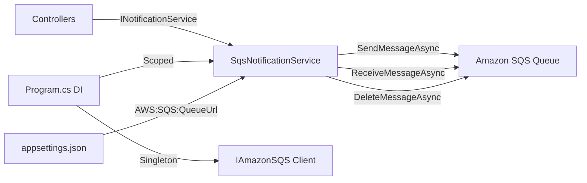

# Design Document: SQS Notification Service

## Overview

This design replaces the in-memory `ConcurrentQueue<Notification>` in `NotificationService` with an Amazon SQS-backed implementation. A new class `SqsNotificationService` implements the existing `INotificationService` interface, using the AWS SDK for .NET (`AWSSDK.SQS`) to send and receive messages. The change is transparent to all consumers — controllers and other services continue to depend on `INotificationService` with no code changes.

## Architecture



The architecture is a simple service-to-queue pattern:
- `IAmazonSQS` is registered as a singleton (one HTTP client for the lifetime of the app)
- `SqsNotificationService` is scoped (one instance per HTTP request), receives the SQS client and configuration via constructor injection
- Messages are serialized/deserialized using Newtonsoft.Json to match existing project conventions

## Components and Interfaces

### INotificationService (unchanged)

```csharp
public interface INotificationService : IDisposable
{
    void SendNotification(string entityType, string entityId, EntityOperation operation, string userName = null);
    void SendNotification(string entityType, string entityId, string entityDisplayName, EntityOperation operation, string userName = null);
    Notification ReceiveNotification();
    void MarkAsRead(int notificationId);
}
```

### SqsNotificationService (new)

**File:** `Services/SqsNotificationService.cs`

| Member | Description |
|--------|-------------|
| Constructor | Accepts `IAmazonSQS` and `IConfiguration`; reads queue URL from config |
| `SendNotification` (2 overloads) | Builds `Notification`, serializes to JSON, calls `SendMessageAsync` |
| `ReceiveNotification` | Calls `ReceiveMessageAsync` (MaxMessages=1, WaitTime=0), deserializes, deletes message, returns `Notification` |
| `MarkAsRead` | No-op (returns immediately) |
| `Dispose` | No-op (SQS client lifecycle managed by DI container) |

### DI Registration Changes (Program.cs)

```csharp
// Add SQS client as singleton
builder.Services.AddSingleton<IAmazonSQS>(sp =>
    new AmazonSQSClient(Amazon.RegionEndpoint.USEast1));

// Replace existing notification service registration
builder.Services.AddScoped<INotificationService, SqsNotificationService>();
```

## Data Models

### Notification (unchanged)

The existing `Notification` model is reused as-is for serialization:

```csharp
public class Notification
{
    public int Id { get; set; }
    public string EntityType { get; set; }
    public string EntityId { get; set; }
    public string Operation { get; set; }
    public string Message { get; set; }
    public DateTime CreatedAt { get; set; }
    public string CreatedBy { get; set; }
    public bool IsRead { get; set; }
    public DateTime? ReadAt { get; set; }
}
```

### Configuration (appsettings.json addition)

```json
{
  "AWS": {
    "SQS": {
      "QueueUrl": "https://sqs.us-east-1.amazonaws.com/836548370410/contoso-notifications"
    }
  }
}
```

### SQS Message Format

The message body sent to SQS is a JSON-serialized `Notification` object:

```json
{
  "Id": 0,
  "EntityType": "Student",
  "EntityId": "42",
  "Operation": "CREATE",
  "Message": "New Student 'John Doe' has been created",
  "CreatedAt": "2024-01-15T10:30:00Z",
  "CreatedBy": "System",
  "IsRead": false,
  "ReadAt": null
}
```

## Correctness Properties

### Property 1: Serialization Round-Trip Integrity

For any valid Notification object sent via `SendNotification`, when `ReceiveNotification` is subsequently called and retrieves that message, the deserialized Notification SHALL have identical EntityType, EntityId, Operation, Message, CreatedBy, and IsRead field values as the original.

**Validates: Requirements 1.1, 2.2**

### Property 2: Message Consumption Guarantees

For any message successfully returned by `ReceiveNotification`, that message SHALL have been deleted from the SQS queue — ensuring no message is delivered twice by the same receive call.

**Validates: Requirements 2.3**

### Property 3: Interface Contract Preservation

The `SqsNotificationService` class SHALL satisfy the full `INotificationService` interface contract such that replacing `NotificationService` with `SqsNotificationService` in DI requires zero changes to any consuming controller or service.

**Validates: Requirements 4.1, 4.2, 4.4**

## Error Handling

This implementation uses base functionality only — exceptions from the SQS client (network errors, permission issues) will propagate to the caller. No retry logic, circuit breakers, or dead-letter queue handling is included in this initial version.

## Testing Strategy

**PBT Assessment:** Property-based testing is not appropriate for this feature. The implementation is a thin integration layer over an external AWS service with no complex pure-logic transformations. The acceptance criteria test infrastructure wiring, serialization format, and external service calls — all better validated through integration tests and example-based verification.

**Recommended approach:**
- **Manual integration testing:** Verify send/receive against the live SQS queue using the existing notification dashboard UI
- **Smoke test:** Confirm the application starts with the new DI registration and configuration without errors
- **Example-based verification:** Use the existing `NotificationsController` endpoints to confirm end-to-end message flow
